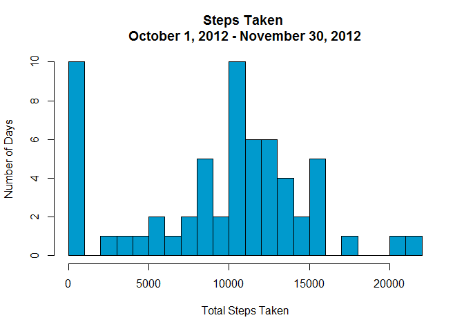
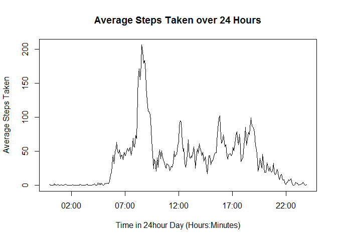
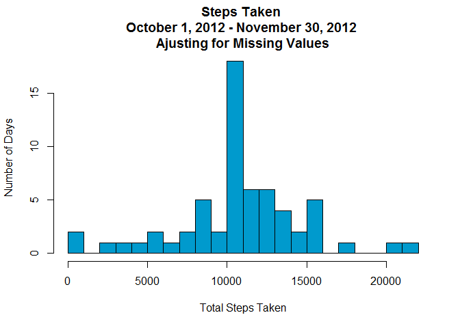
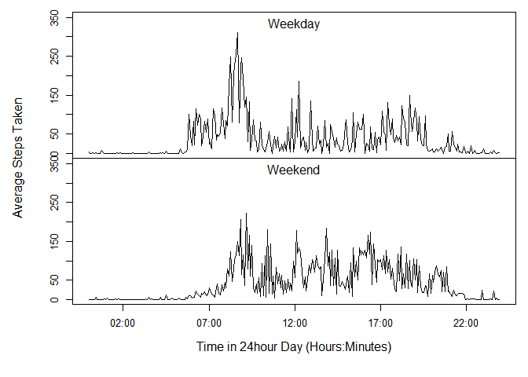

# Reproducible Research: Peer Assessment 1

###Introduction

It is now possible to collect a large amount of data about personal movement using activity monitoring devices such as a Fitbit, Nike Fuelband, or Jawbone Up. These type of devices are part of the "quantified self" movement - a group of enthusiasts who take measurements about themselves regularly to improve their health, to find patterns in their behavior, or because they are tech geeks. But these data remain under-utilized both because the raw data are hard to obtain and there is a lack of statistical methods and software for processing and interpreting the data.

This assignment makes use of data from a personal activity monitoring device. This device collects data at 5 minute intervals through out the day. The data consists of two months of data from an anonymous individual collected during the months of October and November, 2012 and include the number of steps taken in 5 minute intervals each day.

The data for this assignment can be downloaded from the course web site:  
[Activity monitoring data](https://d396qusza40orc.cloudfront.net/repdata%2Fdata%2Factivity.zip) [52K]

The variables included in this dataset are:  
**steps**: Number of steps taking in a 5-minute interval   (missing values are coded as NA)  
**date**: The date on which the measurement was taken in YYYY-MM-DD format  
**interval**: Identifier for the 5-minute interval in which measurement was taken  

The dataset is stored in a comma-separated-value (CSV) file and there are a total of 17,568 observations in this dataset.

###Loading and preprocessing the data
Code for loading the data.  The data is available via the course github repository (linked above) and thus its download is not coded for.

```r
unzip("activity.zip")
activity<-read.csv("activity.csv")
```
Loading necessary packages, and preprocessing the data


```r
require(dplyr)
require(stringr)
#This will load packages.  Will install packages if not already available in library

activity$interval<-str_pad(activity$interval, 4, pad="0")
  #Adds leading zeros to interval so each value has 4 digits;needs "stringr" package.
```

###What is the mean total number of steps taken per day?  
Histogram of the total number of steps taken each day  

```r
perday<-select(activity, steps, date)
  #Selects relevant variables
perday<-group_by(perday, date)
  #Groups by day
perday<-summarise(perday, steps=sum(steps, na.rm=TRUE))
  #Calculates sum of steps by day  

hist(perday$steps, xlab="Total Steps Taken", ylab="Number of Days", breaks=20, main="Steps Taken \nOctober 1, 2012 - November 30, 2012", col="deepskyblue3")
```

 
  
Mean and Median total number of steps taken per day

```r
specs<-cbind(mean(perday$steps, na.rm=TRUE), median(perday$steps))
colnames(specs)<-c("Mean", "Median")
rownames(specs)<-"Daily Steps Taken"
specs
```

```
##                      Mean Median
## Daily Steps Taken 9354.23  10395
```

###What is the average daily activity pattern?  
Time series plot

```r
byinterval<-select(activity, steps, interval)
    #Selects relevant variables
byinterval<-group_by(byinterval, interval)
    #Groups by interval
byinterval<-summarise(byinterval, "average.steps"=mean(steps, na.rm=TRUE))
    #Calculates mean steps for each interval

bytime<-byinterval
    #Creates new dataframe for time calculations
bytime$interval<-strptime(bytime$interval, format="%H%M")
    #Formats interval as time
plot(bytime$interval, bytime$average.steps, type="l", ylab="Average Steps Taken", xlab="Time in 24hour Day (Hours:Minutes)", main="Average Steps Taken over 24 Hours")
```

 

Which 5-minute interval, on average, contains the maximum number of steps?

```r
byinterval[byinterval$average.steps==max(byinterval$average.steps),]
```

```
## Source: local data frame [1 x 2]
## 
##   interval average.steps
## 1     0835      206.1698
```
###Inputing missing values
Total number of missing values in the dataset

```r
sum(is.na(activity))
```

```
## [1] 2304
```
  
Where there are missing values in the data (i.e. where steps have not been recorded) bias may have been introduced into the calculations and/or summaries.  To address this, the mean value for that 5-minute time interval has been used.

```r
ajusted<-activity
    for (i in 1:nrow(activity)){
        if (is.na(activity$steps[i])==TRUE){
            ajusted$steps[i]<-as.numeric(byinterval[byinterval$interval==(activity$interval[i]),2])
    }
  }
```
  Histogram of the total number of steps taken each day, with respective mean interval values replacing NA values.  

```r
perdayajusted<-select(ajusted, steps, date)
  #Selects relevant variables
perdayajusted<-group_by(perdayajusted, date)
  #Groups by day
perdayajusted<-summarise(perdayajusted, steps=sum(steps, na.rm=TRUE))
  #Calculates sum of steps by day 

hist(perdayajusted$steps, xlab="Total Steps Taken", ylab="Number of Days", breaks=20, main="Steps Taken \nOctober 1, 2012 - November 30, 2012 \nAjusting for Missing Values", col="deepskyblue3")
```

 
  
A Table Comparison of estimated mean and median values of daily steps taken shows how these values differ from the estimates taken from the fist part of the assignment.  Substituting the average steps taken for each interval when there were missing data, increases the estimated mean of steps taken daily, and puts it in closer alignment with the estimated median of steps taken daily.


```r
table<-rbind(mean(perday$steps, na.rm=TRUE), mean(perdayajusted$steps))
table<-cbind(table, rbind(median(perday$steps, na.rm=TRUE), median(perdayajusted$steps)))
rownames(table)<-c("Initial Data", "NAs Ajusted")
colnames(table)<-c("Mean","Median")
table
```

```
##                  Mean   Median
## Initial Data  9354.23 10395.00
## NAs Ajusted  10766.19 10766.19
```

###Are there differences in activity patterns between weekdays and weekends?
This section relies on the dataset with the missing values substituted to reflect the mean value at their respective intervals.

The panel plot below compares the steps taken throughout the day averaged across weekdays or weekends.  The Total Avearage Steps taken throught the day for weekdays and weekends is summarized in the table that follows.

```r
ajusted$date<-strptime(ajusted$date, format="%Y-%m-%d")
ajusted$day<-weekdays(ajusted$date)
    #Adds day of the week column to dataset

weekend<-c("Saturday", "Sunday")
weekday<-c("Monday", "Tuesday", "Wednesday", "Thursday","Friday")

par(mfrow=c(2,1), cex=.8)
par(mar=c(0,0,0,0), oma=c(6,6,1,1))
  #Sets parameters for desired panel plot using base plot

weekdays<-ajusted[ajusted$day==weekday,]
    weekdays$date<-NULL;weekdays$time<-NULL
        #Removes incompatible time variables
    weekdays<-group_by(weekdays, interval)
    weekdays<-summarize(weekdays, average.steps=mean(steps))
    weekdays$interval<-strptime(weekdays$interval, format="%H%M")
  
    plot(weekdays$interval, weekdays$average.steps, type="l", xaxt='n', ylim=c(1,350))
        mtext("Weekday", side=3, line=-1.5)

weekends<-ajusted[ajusted$day==weekend,]
    weekends$date<-NULL;weekends$time<-NULL
    weekends<-group_by(weekends, interval)
    weekends<-summarize(weekends, average.steps=mean(steps))
    weekends$interval<-strptime(weekends$interval, format="%H%M")

    plot(weekends$interval, weekends$average.steps, type="l", ylim=c(1,350))
        mtext("Weekend", side=3, line=-1.5)

mtext("Average Steps Taken", side=2, outer=TRUE, line=4, las=3)
mtext("Time in 24hour Day (Hours:Minutes)", side=1, outer=TRUE, line=3) #Sets outer plot labels
```

 

```r
table<-rbind(sum(weekdays$average.steps), sum(weekends$average.steps))
colnames(table)<-"Average Total Steps"
rownames(table)<-c("Weekdays", "Weekends")
table
```

```
##          Average Total Steps
## Weekdays            10133.54
## Weekends            12170.02
```
